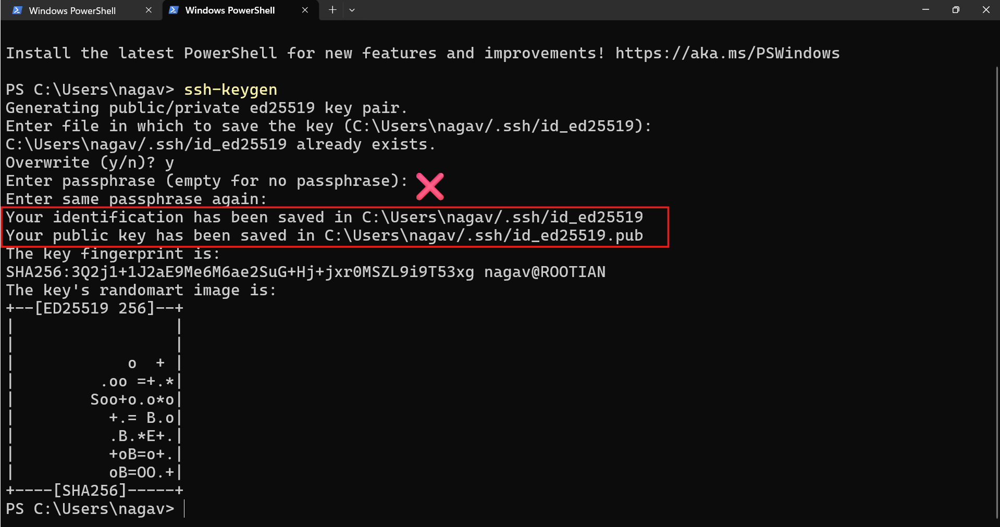
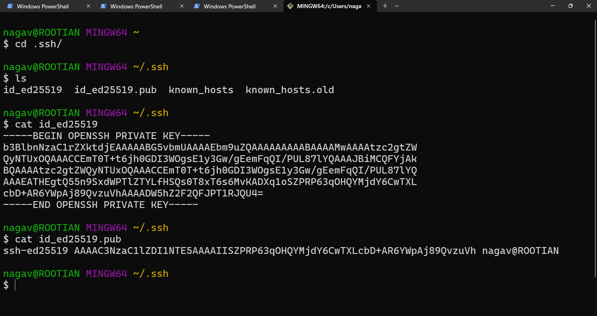
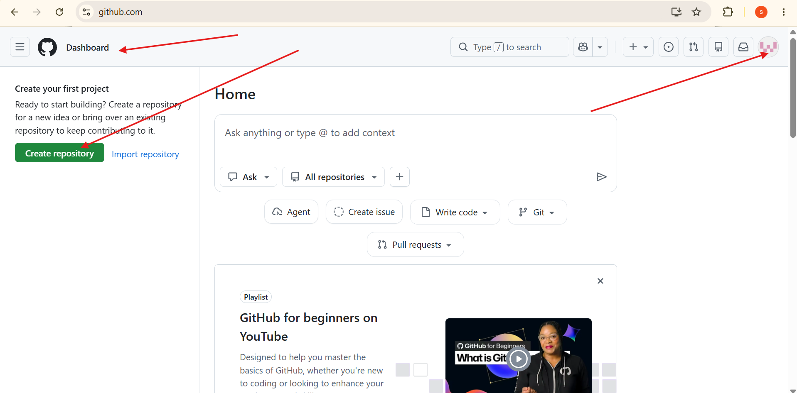

### How to login a sever 
* username and password 

* what cloud has done, they have disbaled password authentication by default.
    * username and passwords are not going to work 

## what is the best way to connect servers/virtual machines/instances?

* ssh protocol - to connect securely remote severs 
* SSH-KEYS - we can create **public and private keys**. 
    * There two alogorithms 
        * rsa (older)
        * ed25519 (newer)

## we can create KEYS using above algorithms 
* windows 
* linux 
* macos 

### let's create keys 
```bash
ssh-keygen
```
* open powershell/terminal and run the above command
* keys are going to store in **.ssh** folder (default folder for ssh)
* The below images shows,
    * How to generate private and public keys in windows. 



* To view private key and public key
    * open gitbash
        * use `cat` command to view content




## let's create github account. 

[refer here](https://github.com/) for github offical website. 



## we need to configure gmail and username of github. 

* in github default branch name **master**
* later it has changed to **main**