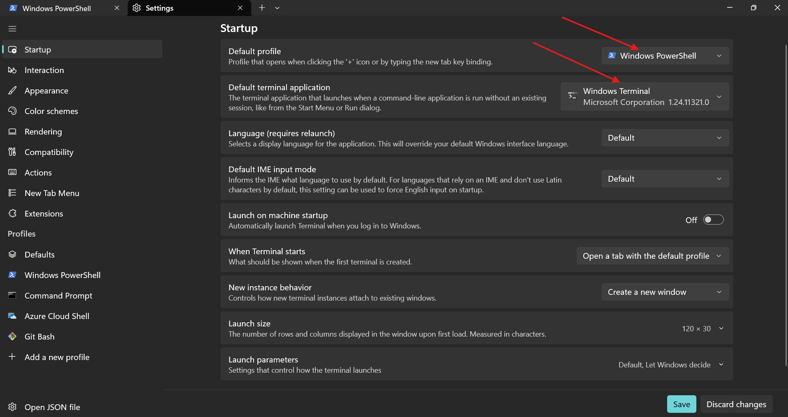
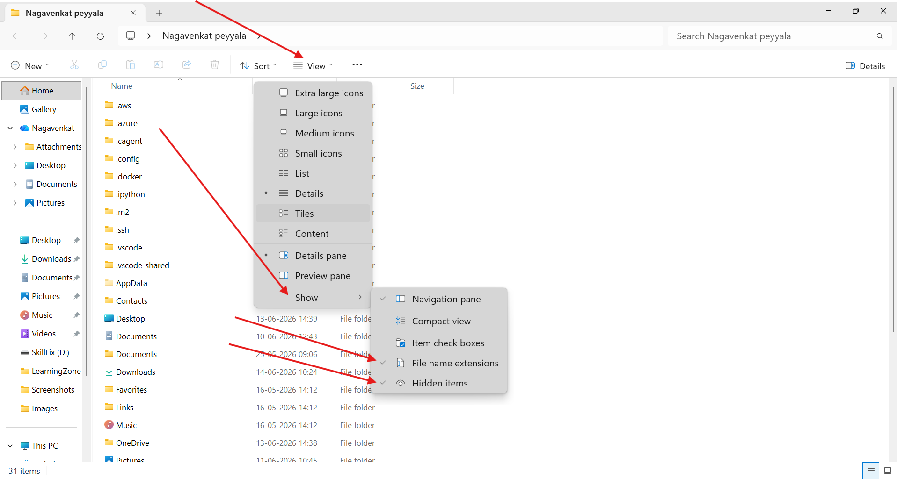
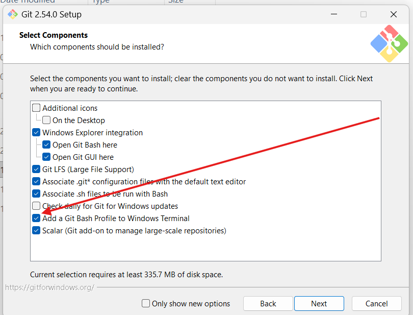

## system prequisites 

* 8 GB or above RAM 
* SSD 512 GB 
* Windows 10/11
* CPU
* GPU (recomended)

# System setup

### command line interface
#### windows 
* Command prompt ( older and used legacy applications)
* Powershell (in 2006 and new)
* windows also introduced Terminal application to support all the cli tools
  * we can add any cli tool to the terminal 
  * windows 11 terminal by default installed 
  * windows 11 install it form microsoft store  
  * microsoft has followed
    * **verb-noun format for cli in windows**. 
      * New-item <filename.extenstion>
      * Remove-item <filename.extenstion>
      * Get-Timezone
      * Get-command
      * Show-Command
    *  To open windows file explorer from powershell/terminal is **start .**
       *  where `.` means current location. 
  


* enable filename extenstions and hiddent items



  
#### mac os 
* Terminal is for macos


### Git Bash
* while installing gitbash do manullay
* **click on add gitbash profile to the windows terminal** as shown in below image. 



* **use of gitbash:** it supports linux environment commands windows.


### Pacage Manger 
* windows: winget( windows packge manger)
  * winget --version 
* macos: Homebrew 
* Linux 
    * Debain Family: apt/apt-get
    * RedHat Family: yum/dnf
* To download and install any software package, you can use package manager. 

### Visual studio code 
* To install vscode: `winget install -e --id Microsoft.VisualStudioCode`
* `code --version`
* Installing extenstions
  * we need to install extenstions in vscode. 
    * python 
      * To create python files extension is `.py`
        * for example: main.py
    * jupyter
        * To create python files extension is `.ipynb`
          * for example: practice.ipynb
    * vscode-icons

  * To open vscode from Terminal use `code .`

### Python 

* To install python: `winget install -e --id Python.Python.3.13`
* To check the version: `python --version`

### aws cli

`winget install -e --id Amazon.AWSCLI`
`aws --version`

### azure cli

`winget install -e --id Microsoft.AzureCLI`
`az version`

### Cloud Accounts

## AWS Account Free tier account 6 months 100 $
* 5 tasks you can earn 100 $ more 
* 12 months some services is going to free

    * Gmail
    * Mobile
    * ID (pan/adhar/voter/driving license)
    * debit/credit/upi
      *  International Transcations 
      *  e commerce Transcations
      *  online Transcations
   * 2/- charge( Refundable)

## Azure Account Free tier account 1 months 200 $
* Gmail
* Mobile
* debit/credit
    *  International Transcations 
    *  e commerce Transcations
    *  online Transcations
* 2/- charge( Refundable)

## 1. prompt

```
you are an expert in creating free tier cloud accounts in india,
i want to create aws and azure free tier accounts. 
i have <bankname> and debit/credit <typename> will support to create cloud accounts
```
## 2. prompt
``` 
you are an expert in <bank name>
How to enable international transcations to my bank
```


