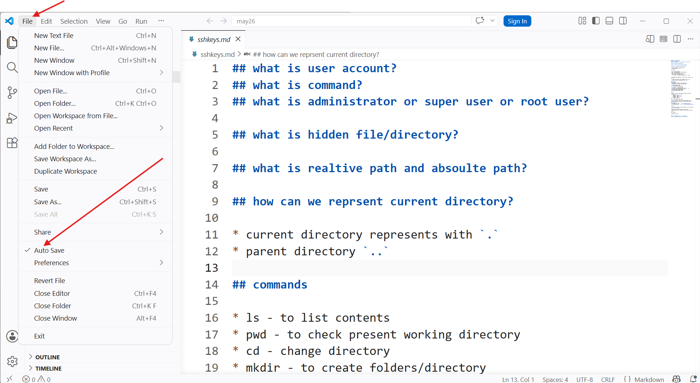
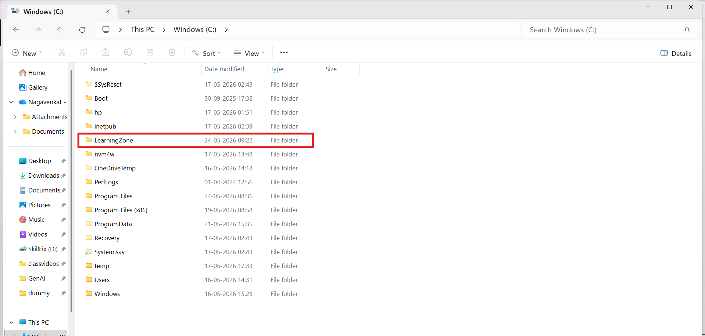

## system setup

* Get-ChildItem

* Verb-Action
* process ?
* get-process
* get-service
* New-Item
* Remove-Item 

- * wildcard - which can help to match patterns 
- | 


A  -> water bottles ;     command 1-> out put 
B  -> labels for bottles  command 2 

* Get-Alias 

## Installations

### Terminal (windows & macos) 
* for windows 10, need to install it from microsoft store
* for windows 11 and mac os by default terminal installed. 

* command prompt ( older one)
* powershell ( new)


* Terminal - it act like window 
* `start .` can use to open windows file explorer. 


### Gitbash - supports linux environment commands

* [Refer Here](https://git-scm.com/install/windows) 

Note: while installing gitbash,

- [x] add gitbash profile to terminal 

## windows package manger 
* chacolatey(community)
* winget 

* To upgrade all the software packages 
```bash
winget upgrade --all
```

## mac os package manger
* install homebrew package manager. 
* [Homebrew](https://brew.sh/)

    * /bin/bash -c "$(curl -fsSL https://raw.githubusercontent.com/Homebrew/install/HEAD/install.sh)" 

## linux distributions 

* debain family - apt, apt-get
* redhat family - yum, dnf 


## vscode (visual studio code)
search `winget vscode` 
```bash
winget install -e --id Microsoft.VisualStudioCode
brew install --cask visual-studio-code # for macos
```
* `code .`  to open vscode from terminal 


* enable autosave in vscode 



## python 
```bash
winget install -e --id Python.Python.3.13
brew install python@3.13 
```
### set-executionpolicy as unrestricted or Remotesigned 

* open powershell as an adminstrator 
```bash
Set-ExecutionPolicy RemoteSigned
Set-ExecutionPolicy Unrestricted
```

## gcp cli
winget install --id=Google.CloudSDK -e

## aws cli
winget install -e --id Amazon.AWSCLI

## azure cli
winget install --exact --id Microsoft.AzureCLI


# cloud accounts 


* Google cloud account (wait for sir instruction)
    * free tier account 300$ for 3 months 
    * gmail 
    * debit/credit card (enable international transcations)
        * 2/- rs is going debit(refundable)
        * enale all showing below
        * international transcations
        * ecommerce transcations
        * online transcations 

    * upi (i am not recommending) 
        * setup autopay 15000/- 


* aws 

    * 6 months -100$ 
    * 5 tasks - 100$ (we can earn )
    * some services are going give 12 months 
    * gmail 
    * mobile number 
    * pan/voterid/adhar 
    * debit/credit/upi ( enable international transcations)


* azure
    * for 1month 200$ 
    * gmail 
    * mobile number      
    * debit/credit/upi ( enable international transcations)


### docker desktop 
```bash
winget install -e --id Docker.DockerDesktop
```

## i will take in the next session.

### ssh keys
### creating servers in aws/azure and connecting 
### github account setup 


* lab timings 11:00 am to 6:00 pm 

### add-ons
* Git/Github
* CICD/GITHUB ACTIONS
* Docker 

```text
you are an expert in system engineering and windows,
i want to uninstall git bash and all its related files over powershell, can you give commands
```
## To clean cache your system

* win+R
```bash
temp
%temp%
prefetch
cleanmgr
```


* when you open powershell -- Default user's home directory 
* don't run here uv init or terraform init or git init
* if you only have C drive then 
    * create folder in C drive (as shown in below)

    
    * create all the course folders in `learningzone`
        * deepagents
        * pyhton 
        * MCP
        * RAG

