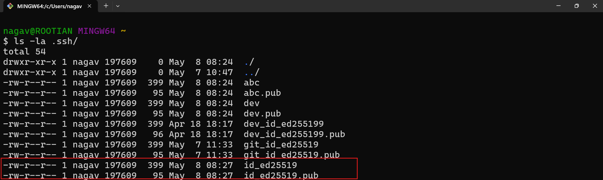
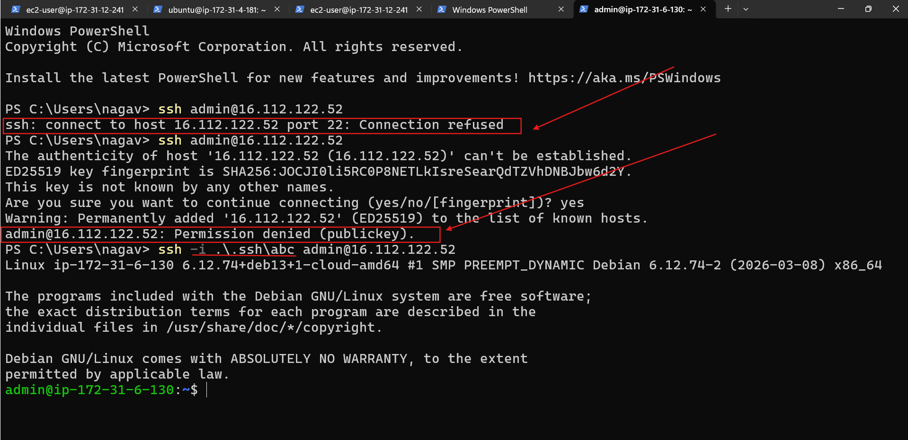

## what is user account?
## what is command?
## what is administrator or super user or root user?

## what is hidden file/directory?

## what is realtive path and absoulte path?

## how can we reprsent current directory?

* current directory represents with `.`
* parent directory `..`

## commands 

* ls - to list contents
* pwd - to check present working directory 
* cd - change directory
* mkdir - to create folders/directory
* new-item/ni - to create files 
    * in linux to create files/empty files - `touch` 

* while working commandline, to autofill the content we can use `TAB`

* To open file explorer over command line use `start`
* To open vscode over command line use `code`

## ssh keys
### alogorithms 
* rsa (older) -> (public and private keys)
* ed25519 (newer) (public and private keys)

* in windows/macos/linux 

* `ssh-keygen` - to generate keys 
* by default ssh keys are going to store in `.ssh`
* we can create customised keys as well 
* the image shows default sshkeys 

## aws 

in aws for instances they have given default users/user accounts
    * amazon linux - `ec2-user`
    * ubuntu - `ubuntu`
    * windows - administrator
    * debian - admin
    * redhat - ec2-user
## 

[refer here](https://docs.aws.amazon.com/AWSEC2/latest/UserGuide/managing-users.html) for default users in aws. 

#### examples * 
* for default ssh keys -  `ssh ec2-user@98.130.46.191`
* for customized keys - `ssh -i .\.ssh\abc admin@16.112.122.52`

## azure

* in azure if you want to create resources, first you need to create `resource group`. 

* we need to create one resource for `sshkeys` 
* for creating server we need to create different resource groups. 

lab timings. 

11:00 am to 6:00 pm 

## how to configure aws cli to aws account 
## how to configure azure cli to azure account
