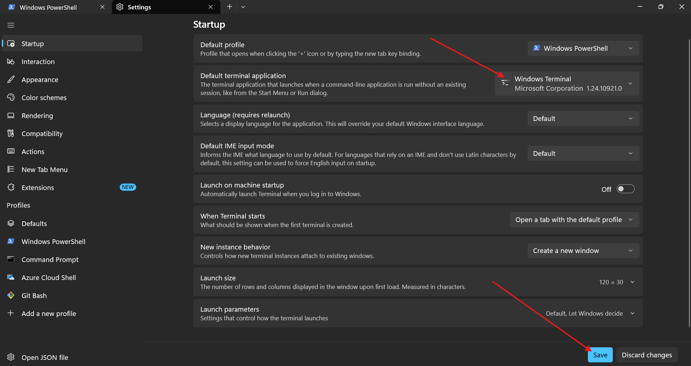
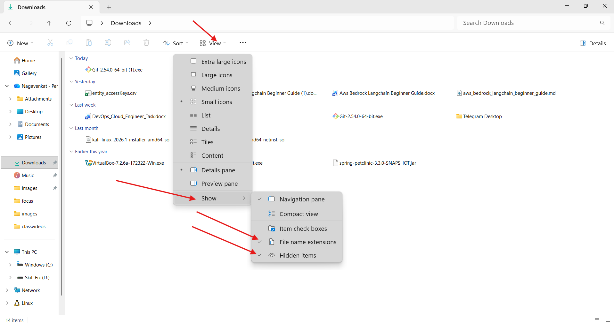
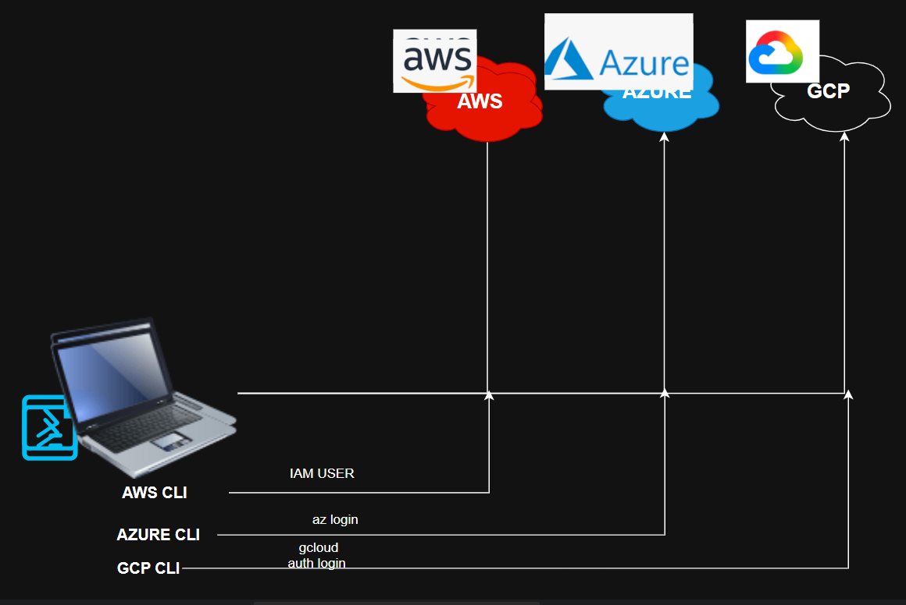
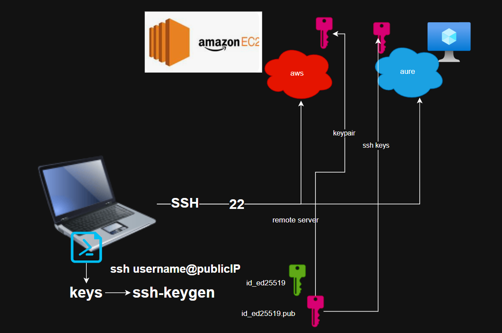

# system setup
* we need to install softwares in windows/mac os (Personal laptops)
     * Terminal 
        * windows11 (terminal has installed by default)
        * windows10 (install it from microsoft store)
        * macos (you have terminal by default)
            * addtional setting for windows users as shown below. 
       
    * Git Bash ( only windows)
        * git bash can support linux environment commands in windows systems.
    * NOTE:
        * add git bash profile to windows terminal


     * Visula Studio Code
     ```bash
     winget install -e --id Microsoft.VisualStudioCode # for windows
     brew install --cask visual-studio-code # for mac os
     ```

     * python 

```bash 
     winget install -e --id Python.Python.3.13 # for windows
     brew install python@3.13
```
        * uv  ( Pacage Manger for python)
```bash
winget install -e --id astral-sh.uv # for windows
brew install uv
```

     * aws cli
```bash
winget install -e --id Amazon.AWSCLI # for windows
brew install awscli # for macos
```
     * azure cli
```bash
winget install -e --id Microsoft.AzureCLI
brew install azure-cli
```


* gcp cli ( for Generative AI) 
    * open powershell as administrator ( for windows)
* those who want to install gcp cli
NOTE: 
* set-executionpolicy (for windows )
* run the below to in powershell 
```bash
Set-ExecutionPolicy Unrestricted
```
* next 
```bash
output has to be like
PS C:\WINDOWS\system32> Get-ExecutionPolicy
RemoteSigned
```
* now, we can install gcp cli 
```bash
winget install -e --id Google.CloudSDK
brew install --cask gcloud-cli
```
---
## windows setting 
* enable hidden items and filename extentions in windows 
    * open file explorer -> show -> enable hidden items and file name extentions.



---

* Cloud accounts creation 
    * aws 
        * for 6 months 100$ (free tier account)
        * one more `100$` we can earn by completing task given aws.
    * To create [aws](https://signin.aws.amazon.com/) **free tier account** 
         * gmail (real)
         * mobile number 
         * adhar/pan/driving license/
         * **debit/credit (Interanational transcations/ecommerce/Online Transactions trancsacation has to enabled)**
    * while creating aws account 2/-rs is going charge which is refundable.
```bash
act as expert in aws cloud, i am using sbi bank and i have visa debit card, will this help to create aws free tier account
```

* azure 
    * free tier 1 month offering `200$` 
    * To create [azure](https://azure.microsoft.com/) **free tier account** 
         * gmail (real)
         * mobile number 
         * **debit/credit (Interanational transcations/ecommerce/Online Transactions trancsacation has to enabled)**
    * while creating aws account 2/-rs is going charge which is refundable.
```bash
act as expert in azure cloud, i am using sbi bank and i have visa debit card, will this help to create aws free tier account
```

* gcp ( for Generative AI)
    * 3 months free tier account - `300$`
    * To create [gcp](https://cloud.google.com/) **free tier account** 
         * gmail (real)
         * mobile number 
         * **debit/credit (Interanational transcations/ecommerce/Online Transactions trancsacation has to enabled)**
    * while creating aws account 2/-rs is going charge which is refundable.
```bash
act as expert in gcp cloud, i am using sbi bank and i have visa debit card, will this help to create aws free tier account
```

### NOTE:
* Prefer debit/credit
* Don't prefer `UPI`

* SSH KEYS 
    * How to create ssh keys in windows/macos/linux
    * How to import ssh keys to aws/azure.
* How to launch instance in aws account 
* How to launch virtual machine in azure
* How to configure aws cli to aws account
* How to configure azure cli to azure account
* How to configure gcp cli to gcp account ( for Generative AI)

# Package Mangers
* we have different operating systems
    * windows -> `winget` ( microsoft) or chacolety (community, older)
        * pulling software package
        * download
        * install
        * path configuration to system
```bash
        PS C:\Users\nagav> winget --version # to check the winget version
            v1.28.240
```
* mac os -> `Homebrew`
        * install Howmbrew [in macos](https://brew.sh/) 
        ```bash
        /bin/bash -c "$(curl -fsSL https://raw.githubusercontent.com/Homebrew/install/HEAD/install.sh)"
        ```

    * Linux 
        * ubuntu - `apt, apt-get`
        * redhat - `yum, dnf` 
    

* To stop process in cli(command line interface)
    * `ctrl + C` 
* To terminal screen 
    * `clear/ ctrl + l` 

## How to configure aws cli to aws account
* IAM User for cli -> open terminal run `aws configure` -> give access key and secret key -> region -> output
    * aws s3 ls to check connection established or not

## How to configure azure cli to azure account
* open terminal run `az login`
    * az group list to check connection established or not

## How to configure GCP cli to gcp cloud account
* we have to configure two type of authentication 
    * for cli -> gcloud auth login
    * for code -> gcloud auth application-default login 

* [refer here](https://www.youtube.com/@LearningThoughts/playlists)
  


## ssh keys

* while provisioning servers, we have to understand how we can authenticate/login into servers. 
    * username/password ( not a good practice)
    * access servers over sshkeys (good practice)

* we can create keys with two alogorithms
    * rsa (older)
    * ed25519 (newer)

* while launching server/instance/virtual machine in aws/azure
    * name
    * operating system image
    * hardware configuration ( cpu and RAM)
    * keypair for login
    * network settings
         * enable public 
         * ssh allow
    * storage 

## ssh protocol 
* ssh stands for secure shell protocol 
* ssh port number 22 


## how to create ssh keys in windows/ macos
* open terminal run `ssh-keygen`



## creating instance in aws

* while creating instance using ssh default keys, use command to login `ssh ec2-user@54.188.224.55`
* in aws we have to create keys for each region
