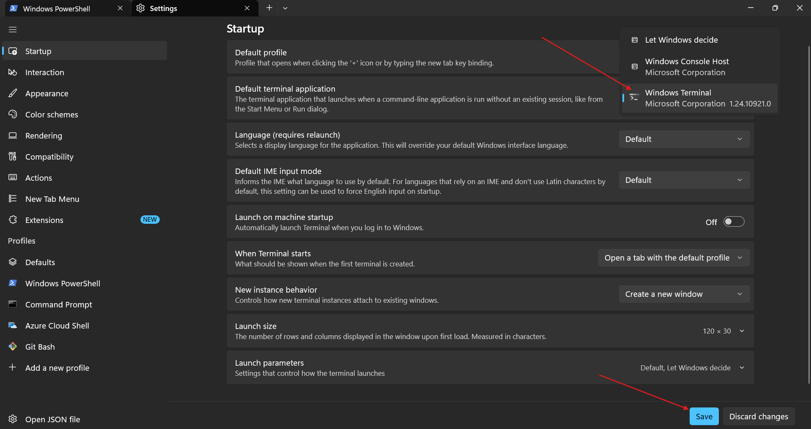
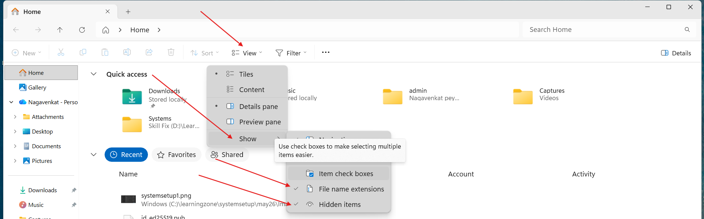
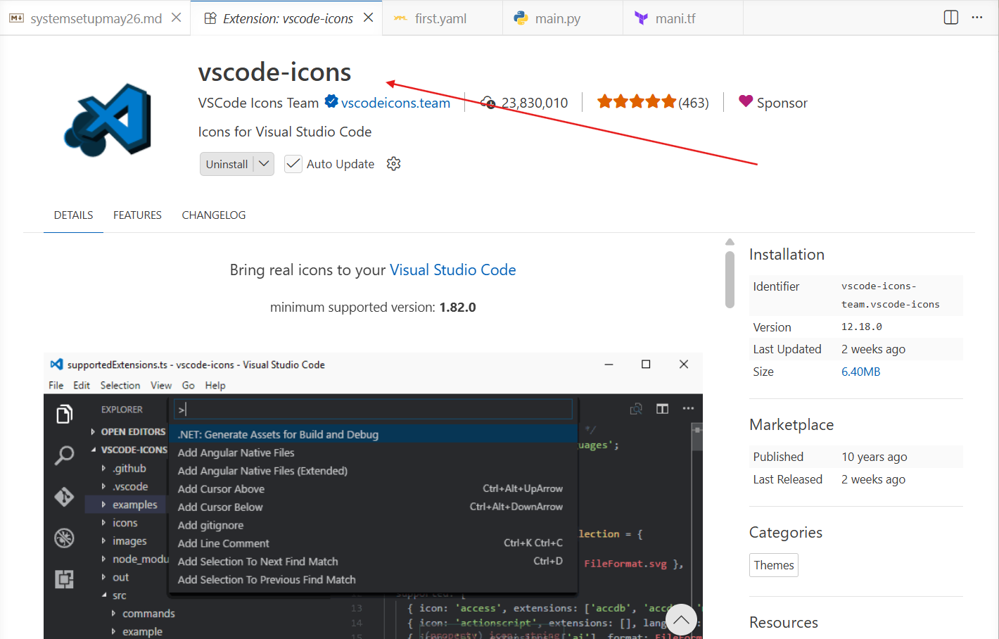

## windows playground 
```bash
Get-Alias  # To list all the windows commands
```


## systemsetup 

### terminal 
* for windows10 (we need to install)
* for mac os - terminal

* in terminal settings 



## enable hidden items and file name extentions




## gitbash (integrate to terminal)
* install manullay
* **add git bash profile to the terminal**


## visual studio code 
```bash
winget install -e --id Microsoft.VisualStudioCode ## code --version
brew install --cask visual-studio-code # for macos `code --version`
```

```prompt
you are an expert in vscode, i am beginner i want to learn how to vscode, teach me from the scratch.
```


### we can install extenstions 


## python 
```bash
winget install -e --id Python.Python.3.13 ## python --version
brew install python@3.13 ## python --version
```

## uv (python package manger) ultra fast

```bash
winget install -e --id astral-sh.uv ## uv --version
brew install uv ## uv --version
```

### pip (package manager for pyhton which older and slow)
  * by default pip will come along python software package


## aws cli

```bash
winget install -e --id Amazon.AWSCLI  ## aws --version
brew install awscli # for macos
```
## azure cli

```bash
winget install -e --id Microsoft.AzureCLI ## az version
brew install azure-cli 
```

## gcp cli (for gen ai) open powershell and run as adminstrator

```bash
PS C:\Users\nagav> Get-ExecutionPolicy
RemoteSigned
PS C:\Users\nagav> Set-ExecutionPolicy RemoteSigned
## for windows or macos both you have to run 
```

```bash
winget install -e --id Google.CloudSDK ## gcloud --version
brew install --cask gcloud-cli ## for mac 
```

## creating cloud accounts (aws and azure)
    * for gen ai `gcp cloud account` 

### cloud 

### aws cloud account

* 1 year free tier 100 dollars + 100 dollars (5 tasks)

* To get **free tier account**  (new details)

    * gmail
    * mobile number 
    * pan/adhar 
    * debit/credit (interanational transcations) visa, master
    * prefer to create account wiht `card` 

```text
you are an expert in aws, i have <bank name> and debit card <type>(visa/rupay), will it help me to create aws account.
```


### azure cloud account
* one month free tier, 200 dollars 
    * gmail
    * mobile number 
    * debit/credit (interanational transcations) visa, master
        * check your realted `internet banking` or `bank app`
    * prefer to create account wiht `card`

## gcp cloud account 
    * 300 dollars for 3 months 
        * here to get free account, we need to credit 1000/- rs in our gcp account. 
    * gmail
    * debit/credit (interanational transcations) visa, master
        * check your realted `internet banking` or `bank app`
    * prefer to create account wiht `card`


## Package manager
* we are going to use to install software packages.

* for windows `winget` (newer and faster) -- prefer 
    * Chocolatey (older) - no need install

* for mac os `homebrew`
    * install `homebrew` package manager 
    [refer here](https://brew.sh/) for homebrew official docs

    `/bin/bash -c "$(curl -fsSL https://raw.githubusercontent.com/Homebrew/install/HEAD/install.sh)"`

* for ubuntu `apt`  or `apt-get`


## ssh keys
## lanuching instances in aws and azure. 
* we will discuss on friday. 

* winget is for windows
* homebrew is for macos

## for your course 
* create one folder `learningzone` (your entire course details should be in this folder)