# System Setup and Configuration 

## Terminal 

# How to install Terminal

## **Windows Terminal comes pre-installed by default on Windows 11, while Windows 10 users need to install it manually from the Microsoft Store.**

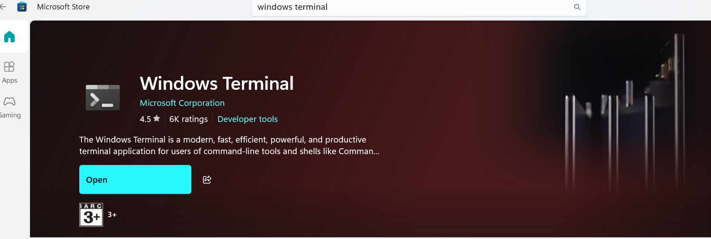

### What is a **terminal** and **Windows Terminal**?

- A terminal is a program that lets you interact with your computer by typing text commands.
- Instead of clicking icons, you type commands to open files, run programs, and manage the system.
- It’s a powerful tool for developers and system administrators.

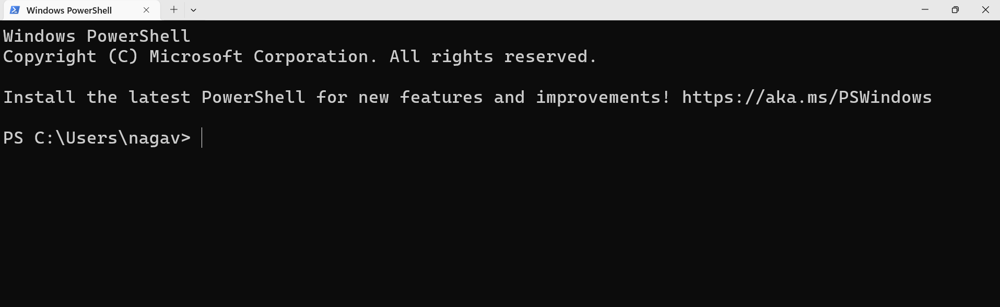
### What is Windows Terminal?

- Windows Terminal is a modern terminal program for Windows.
- It lets you use multiple command-line tools like:
  - **PowerShell**
  - **Command Prompt (CMD)**
  - **Git Bash**
  - **Linux shells (via Windows Subsystem for Linux)**
- It supports **multiple tabs** and **split panes**, so you can use many terminals in one window.
- You can customize colors, fonts, key shortcuts, and more.
- Makes working with command line tools easier and more organized.


### Why Use Windows Terminal?
- Combines many command shells in one interface.
- More flexible and powerful than the old default consoles.
- Suited for developers, DevOps, and power users.

### Additional setting for better usage terminal
- Click on settings as shown in below figure


- Here, `Set Windows Terminal as the default application` and Click `Save`


***
# How to Show File Extensions and Hidden Files in Windows Explorer

### Show File Name Extensions

- Go to the top menu and click **View**.
- From the dropdown, select **Show**, then tick **File name extensions**.
- This will display extensions like ".txt", ".jpg", ".exe" for each file in File Explorer.
- Knowing extensions helps you identify file types and avoid confusion (for example, knowing if a file is actually a program, image, or document).

***

### Show Hidden Files (Hidden Items)

- In the same **View > Show** dropdown, tick **Hidden items**.
- This will make hidden files and folders (usually faded out) visible in File Explorer.
- Hidden files are commonly used for system or application settings and can be useful for troubleshooting or editing configurations.


***


# What is Winget?

- WINGET stands for **Windows Package Manager**. 
- It is a command-line tool from Microsoft that helps users discover, install, upgrade, remove, and manage applications on Windows systems efficiently through simple commands.
- Winget comes pre-installed on Windows 11 and newer Windows 10 versions; otherwise, install it from Microsoft Store.


### How to start

1. Open **terminal**/**PowerShell**.  
2. Type `winget --version` to check if Winget is installed.  


### Run commands like install, and upgrade and uninstall as needed.

- **Install app:**  
  `winget install <app_id>`  
  (Example: `winget install Microsoft.VisualStudioCode`)

- **Upgrade apps:**  
  `winget upgrade`  
  (Upgrades all apps that can be updated)

- **Uninstall app:**  
  `winget uninstall <app_id>`  
  (Example: `winget uninstall --purge Google.Chrome`)

  Here, `--purge` Deletes all files and directories in the package directory (portable)

***
## Git Bash

# How to install Git Bash?
**[Refer Here](https://git-scm.com/install) to install **Git Bash**.**

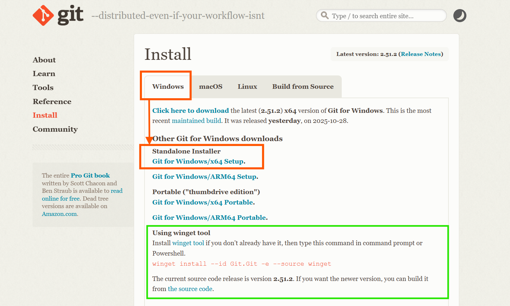

- First download `Git Bash.exe`
- While installing Click on check box `Add Git Bash profile to Windows Terminal`
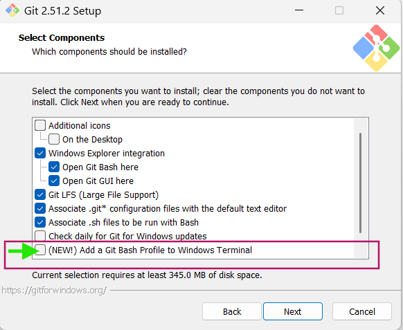


##  What is Git Bash?
- Git Bash is a command-line tool for Windows that provides a Unix-style shell environment. 
- It allows users to run Git commands and use common Unix commands on Windows. 
- It is included as part of the Git for Windows package, helping developers manage version control easily.
***

## VS code
# How to install VS code?
There are mainly **three** ways to install Visual Studio Code (VS Code):

1. Download and run the installer from the official VS Code website.  
2. Install using the Microsoft Store app on Windows.  
3. Use command-line package managers like `Winget` or `Chocolatey` for automated installation.  

[Refer Here](https://winget.run/pkg/Microsoft/VisualStudioCode) to install vscode.

- Let's install with winget


- Open your Terminal run the command to install VS Code 


##  What is VS code?

- Visual Studio Code (VS Code) is a free, lightweight code editor that supports multiple programming languages.
- It helps you write, edit, and run code efficiently with features like IntelliSense, debugging, and extensions.
- You start by opening a folder, creating files, and using its powerful tools for coding, testing, and debugging.
***

## Installing Python and UV for Python Learning

#  How to install python?

To install Python on Windows using winget, open Terminal and follow these simple steps. 

## Step 1: Install
Use the ID for your preferred version, e.g.:  
`winget install -e --id Python.Python.3.13`  


## Step 2: Verify
Close and reopen your terminal, then run:  
`python --version`  
You should see the installed version (e.g., Python 3.13.x). 

### Tip
- Reopen terminal after install for PATH changes to apply. 


## Installing UV on Windows

## What is UV?

UV is an ultrafast Python package and project manager built in Rust by Astral.  
It replaces tools like pip, venv, and pip-tools with a single, unified CLI for managing packages, virtual environments, and Python versions. 

## Why Use UV?

UV delivers 10-100x faster package installs through parallel downloads and smart caching.  
It streamlines workflows with automatic virtualenvs, lockfiles, and dependency resolution for more reliable projects. 

## UV vs Pip

| Aspect | UV | Pip |
|--------|----|-----|
| Speed | 10-100x faster | Baseline |
| Features | Built-in venv, locking, Python mgmt | Installs only |
| Language | Rust binary | Python script |
| Use Case | Full project tool | Simple installs | [pydevtools](https://pydevtools.com/handbook/explanation/whats-the-difference-between-pip-and-uv/)

## Install UV Using Winget

Open Terminal.  
Run: `winget install -e --id astral-sh.uv`  
Verify: `uv --version` (adds to PATH automatically). [winstall](https://winstall.app/apps/astral-sh.uv)

### Tip
- Reopen terminal after install for PATH changes to apply. 


***
# How to install AWS CLI?

## AWS CLI(Command Line Interface)

- To install AWS CLI on **Windows**, download the official MSI installer from the AWS website and run the setup wizard.  

    [AWS Doucmentaion](https://docs.aws.amazon.com/cli/latest/userguide/getting-started-install.html) to install aws cli

- You can also easily install or update AWS CLI on Windows using the winget command:  

    [winget.run](https://winget.run/pkg/Amazon/AWSCLI) to install aws cli with winget

    [winstall.app](https://winstall.app/apps/Amazon.AWSCLI) to install aws cli with winget

```sh
  winget install --id=Amazon.AWSCLI  -e
```
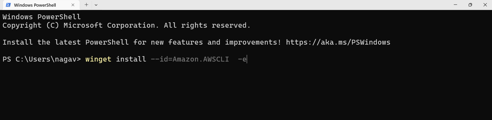
- On **macOS**, you can install AWS CLI using the package installer from AWS or via Homebrew with `brew install awscli`.  


- After installation, verify the setup by running `aws --version` in your terminal.  
##  What is AWS CLI?
- AWS CLI (AWS Command Line Interface) is a tool that lets you manage AWS services from your terminal using commands. It allows you to automate tasks and control AWS resources without using the web console. With simple commands, you can launch instances, manage storage, and configure services efficiently.

***
# How to Configure AWS CLI to Your AWS Account

1. **Create an IAM User:**  
   - Go to the AWS Management Console and open the IAM service.


- Create a new IAM user with **programmatic access** enabled.  
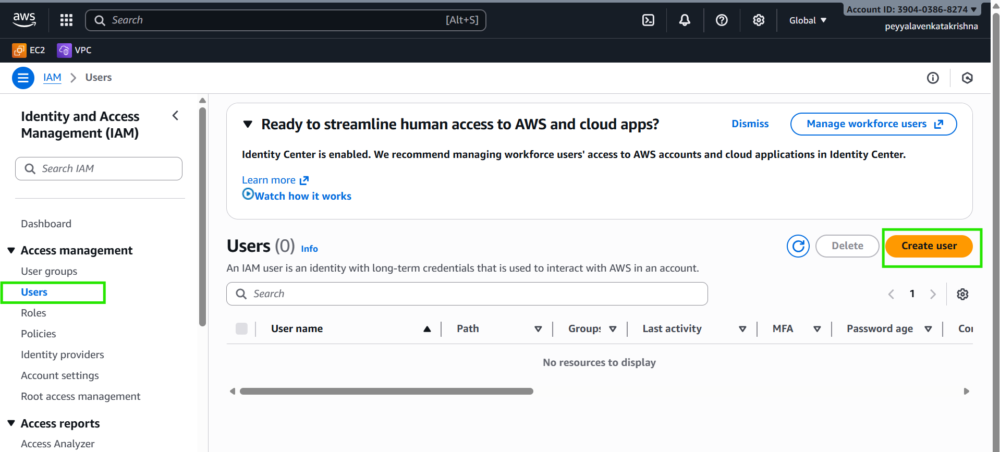

- **Let's create a user**
    


- **Assign the required permissions to the user (e.g., AdministratorAccess or custom policies).**  


- after creation user it will show like this


- Download or note down the **Access Key ID** and **Secret Access Key** for this user.

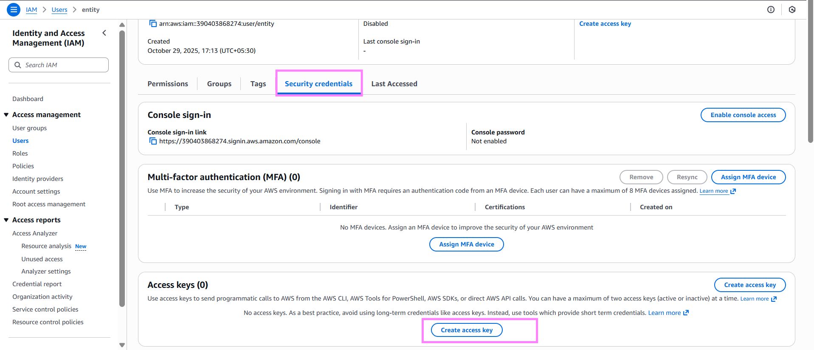

- next click on cli 


- These are the access keys


2. **Configure AWS CLI:**  
   - Open your terminal
   - Run the command:  
     ```bash
     aws configure
     ```
   - Enter the IAM user’s Access Key ID, Secret Access Key, default region (like `us-east-1`), and preferred output format (`json`, `text`, or `table`).  
   - This setup lets AWS CLI communicate securely with your AWS account using the IAM user credentials.

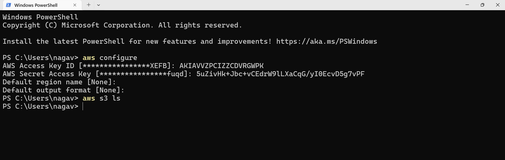

## How to Verify AWS CLI Setup and Configuration

- To verify if AWS CLI is configured and connected to your account, run:  
  ```
  aws s3 ls
  ```
  If this lists your buckets, your AWS CLI is properly connected and has permissions.

- You can also view CLI configuration details with:  
  ```
  aws configure list
  ```

- Another quick check is to list your S3 buckets with:
  ```
  aws sts get-caller-identity
  ```
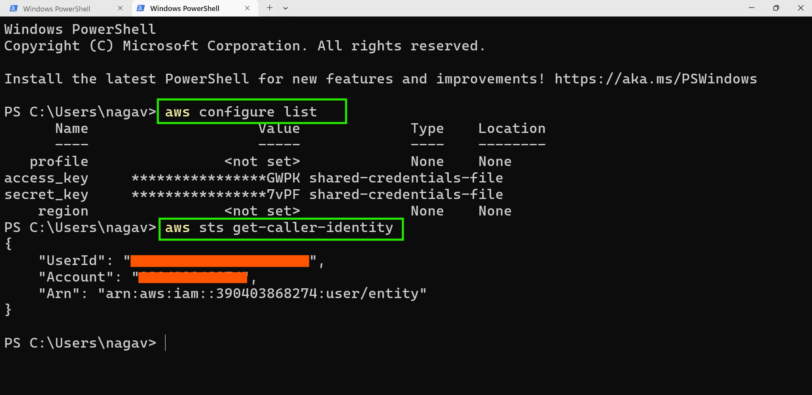

***


# How to install AZURE CLI?


## AZURE CLI(Command Line Interface)

- On **Windows**, you can install Azure CLI by downloading and running the MSI installer from the official Microsoft link or use PowerShell with a command to download and install automatically.  

    [Azure Documentation](https://learn.microsoft.com/en-us/cli/azure/install-azure-cli-windows?view=azure-cli-latest&pivots=winget) to install azure cli.

- You can also install Azure CLI easily using winget by running:  
    [winget.run](https://winget.run/pkg/Microsoft/AzureCLI) to install azure cli.

  ```
  winget install -e --id Microsoft.AzureCLI
  ```
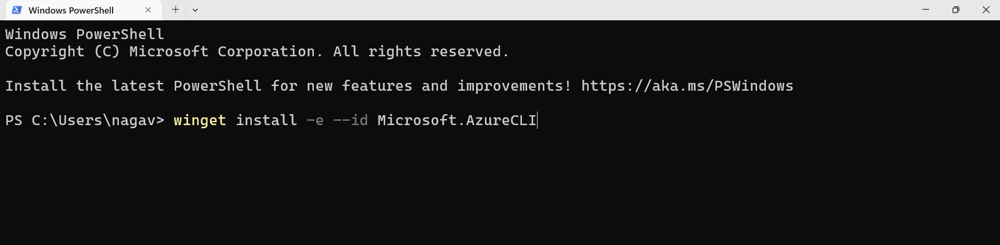

- On **macOS**, install Azure CLI using Homebrew with:  
  ```
  brew install azure-cli
  ```

- After installation, verify by running `az --version` in your terminal or PowerShell.

##  What is AZURE CLI?
- Azure CLI is a cross-platform command-line tool that lets you manage Azure resources from the terminal. It allows you to create, update, and delete resources using simple commands or scripts, making cloud management faster and easier. Azure CLI works on Windows, macOS, and Linux, and can also be used in Azure Cloud Shell directly from a browser.
***

# How to Configure Azure CLI to Your Azure Account

1. **Sign in to Azure:**  
   - Open your terminal or PowerShell.  
   - Run the command:  
     ```
     az login
     ```
   - This opens a browser window for interactive login. If the browser cannot open, follow the instructions to login via a device code, by visiting https://aka.ms/devicelogin and entering the code shown in your terminal.


- Select the email associated with your Azure account and click `Continue`

2. **Select the Subscription (if multiple):**  
   - After login, a list of your Azure subscriptions appears.  
      - Enter the `subscription number`, then press `Enter`.

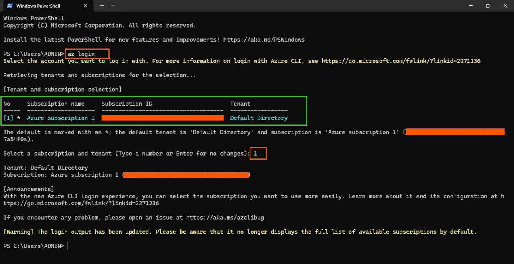  
  
  - If your Azure account has multiple subscriptions, enter the number corresponding to your desired subscription. 

   - To set a specific subscription as active, run:  
     ```
     az account set --subscription "<subscription-id>"
     ```
- You can sign in interactively as above, or use service principals or managed identities for scripts and automation. 

3. **Authentication methods:**  
   - Multi-factor authentication (MFA) is now mandatory for user sign-ins in many setups.

## How to Check if Azure CLI Is Configured with Your Azure Account

- Run the command:  
  ```bash
  az account show
  ```
  This displays details of the currently logged-in Azure account and its active subscription.

- To list all resource groups in your subscription:  
  ```bash
  az group list
  ```


- If there are no resource groups, the command outputs an empty list:  
  ```
  []
  ```
- To list all subscriptions associated with your account, run:  
  ```bash
  az account list --output table
  ```

- If these commands return output without errors, it confirms that your Azure CLI is correctly configured and connected to your account.


***


