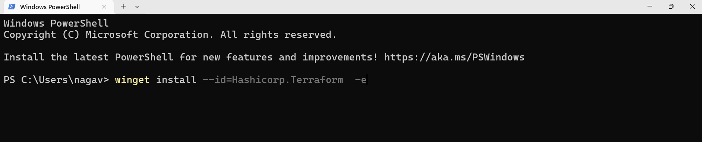
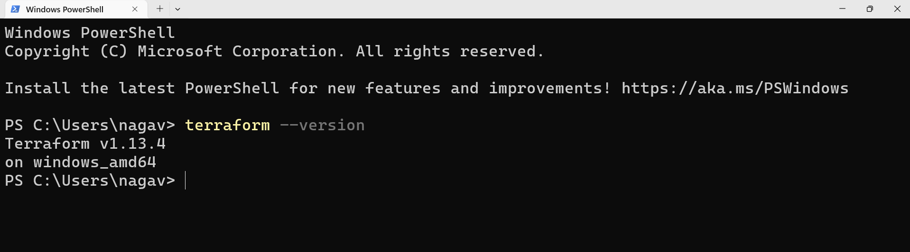

## Terraform
# How to install TERRAFORM?

- On **Windows**, download the Terraform zip from the official HashiCorp website, unzip it, and add the terraform.exe file location to your system's PATH environment variable to run Terraform from any command prompt.  

    [Terraform Documentation](https://developer.hashicorp.com/terraform/tutorials/aws-get-started/install-cli) to isntall Terraform

- You can also install Terraform on Windows using package managers like Chocolatey or winget for easier management. 

    [winstall](https://winstall.app/apps/Hashicorp.Terraform) to install terraform




- On **macOS**, install Terraform easily using Homebrew with the command:  
  ```
  brew install terraform
  ```
- After installation, verify by running `terraform --version` in the terminal.



***
